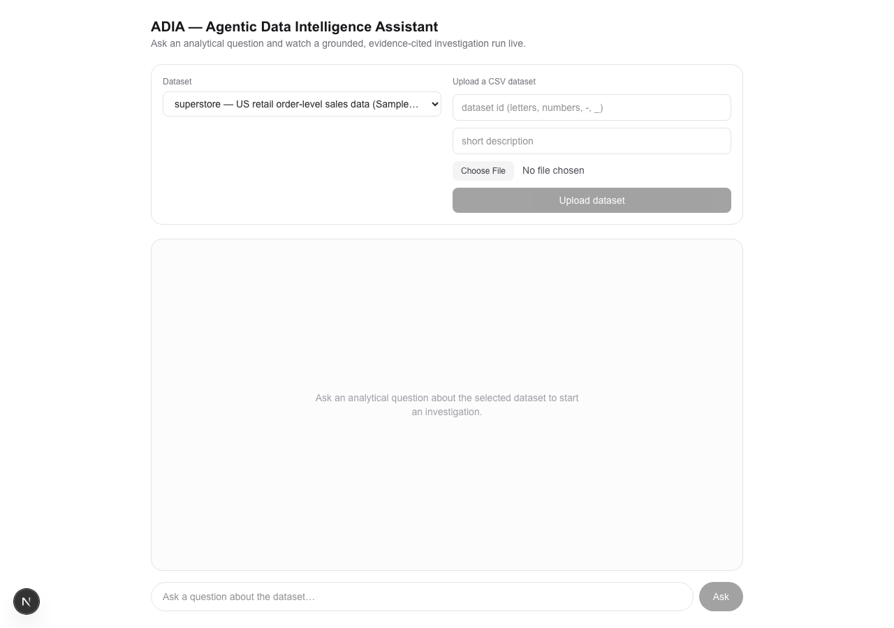
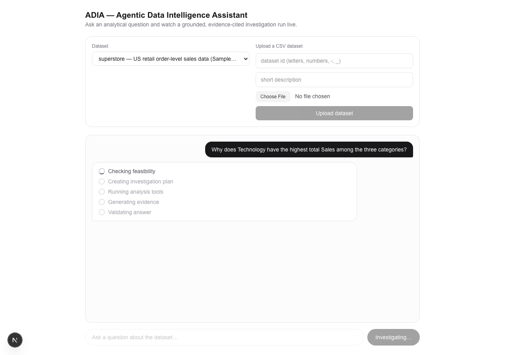
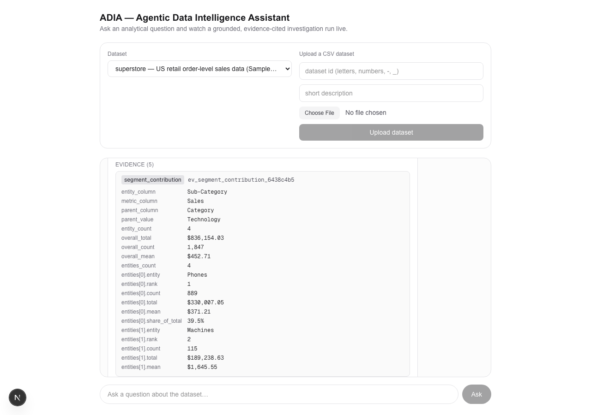
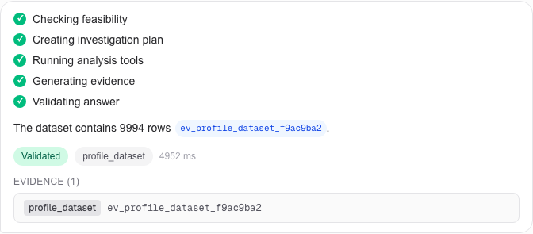
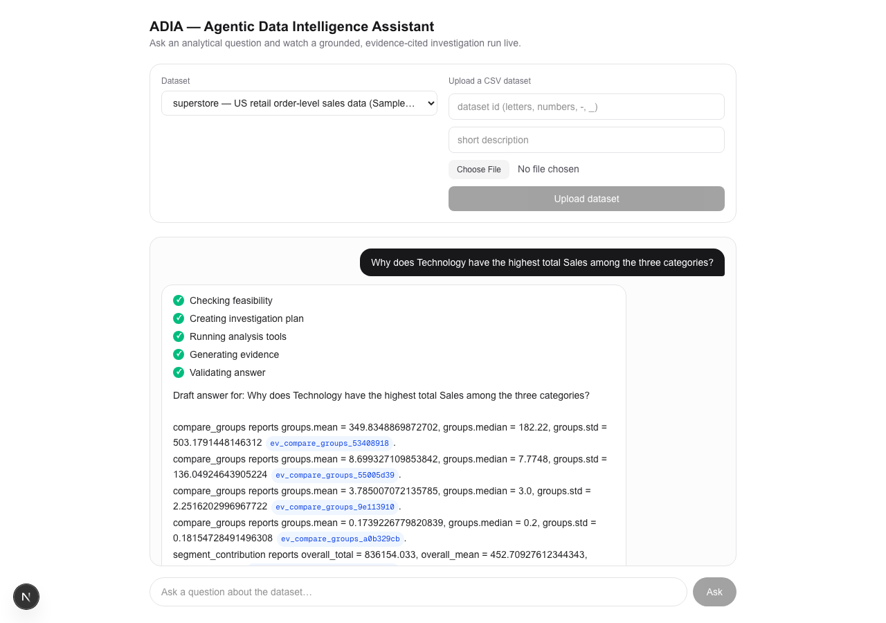

# ADIA — Agentic Data Intelligence Assistant

**An evidence-grounded analytical investigation agent.**

ADIA answers questions about a tabular dataset the way an analyst would, not the way a
text-to-SQL tool does: direct questions get a direct lookup, but "why" questions get a real
investigation — an observation, several evidence-backed candidate explanations, and a
conclusion that is honest about what the data can and cannot establish. Every number in every
answer traces back to a deterministic tool call, not to the language model.

## Problem Motivation

A text-to-SQL system can answer *"Which category has the lowest sales?"* — one query, one
number. But it has no way to answer *"**Why** does Office Supplies have the lowest sales?"*
except by asking an LLM to guess at a plausible-sounding reason, which is exactly how these
systems hallucinate: the explanation is generated text, not a computed result.

A human analyst answers a "why" question differently. They:
1. Establish the fact precisely (which category, by how much).
2. Propose several candidate explanations (order volume? average order value? discount
   patterns? a particular sub-category dragging the average down?).
3. Check each candidate against the data.
4. Report what's actually supported by evidence — and say plainly when the data can't settle
   the question, rather than picking the most plausible-sounding story.

ADIA is built to do the same thing mechanically: **"why" questions require multi-step evidence
gathering**, not a single lookup and not a single LLM guess. The rest of this document shows
how, and measures how often it actually works.

## Architecture

### Agent Workflow

```
                          +--> planner -> execute_tools -> synthesizer --+
                          |                                              |
    START -> feasibility -+                                              +-> validation -> END
                          |                                              |
                          +--> refusal ---------------------------------+
```

A LangGraph state machine, not a single prompt. `feasibility` decides whether the question is
answerable *from this dataset* at all — a question needing external or behavioral data it
can't provide (customer preferences, competitor pricing, future data) is routed straight to a
grounded `refusal`, never reaching the planner. A feasible question goes to `planner`, which
proposes a small dependency graph of steps (not just one), `execute_tools` runs them in
dependency order, `synthesizer` writes a citation-bearing answer from the collected evidence,
and `validation` is the one gate every answer — refusal or not — must pass before it's shown
to the user.

### System Layers

```
┌───────────────────────────────┐
│        python -m adia          │  adia/cli.py — a thin interface only;
└───────────────┬─────────────────┘  no business logic lives here
                │
┌───────────────▼─────────────────┐
│      LangGraph Orchestrator       │  adia/graph — the workflow above:
│                                    │  routing, dependency-ordered execution
└───────────────┬─────────────────┘
                │
┌───────────────▼─────────────────┐
│    Agents (LLM reasoning only)    │  adia/agents — Feasibility, Planner,
│                                    │  Argument Generator, Synthesizer
└───────────────┬─────────────────┘
                │
      ┌─────────┼───────────────────┐
      │         │                    │
┌─────▼─────┐ ┌─▼─────────────┐ ┌────▼──────────────┐
│   Tools    │ │ Evidence Store │ │    Validation       │
│ SQL/stats/ │ │ provenance +   │ │ grounding check on   │
│ ML — real  │ │ citations for  │ │ every final answer,  │
│ computation│ │ every result   │ │ no exceptions         │
│ adia/tools │ │ adia/evidence  │ │ adia/validate         │
└────────────┘ └────────────────┘ └────────────────────┘
```

**The core discipline, in every layer**: an LLM only ever *proposes* — a verdict, a plan
shape, a SQL query, a sentence of prose. Python always *verifies* before anything reaches the
user: a hallucinated column forces a refusal regardless of what the LLM claimed; a SQL query
is parsed and guarded before it ever reaches DuckDB; a synthesized answer is re-checked against
the actual evidence and rejected if it states a number that isn't there. The LLM decides *what*
to compute and *how to say it*; it never *is* the computation.

## Investigation Capability

**Question:** *"Why does Technology have the highest total Sales among the three categories?"*
(`bench` question q026 — the question written specifically to exercise `segment_contribution`,
the decomposition tool added in Phase 7.)

This is a real run of the system — not a mocked example. The Planner produced a 5-step plan:

**1. Decompose the total by Sub-Category** (`segment_contribution`, no dependencies) — instead
of just re-stating that Technology's total is largest, break down *what inside Technology*
makes up that total:
> `segment_contribution(entity_column="Sub-Category", metric_column="Sales", parent_column="Category", parent_value="Technology")`
> → **Phones: 39.5% of Technology's Sales** (rank 1), Machines: 22.6% (rank 2), Accessories:
> 20.0% (rank 3), Copiers: 17.9% (rank 4)

**2–4. Supporting comparisons across all three categories** (`compare_groups`, each testing a
distinct candidate explanation): average Sales per order, average Discount, average Profit
margin — checking whether Technology simply sells at a higher price point, discounts less, or
is more profitable per order.

**5. Decompose the total by Region** (`segment_contribution` again, `depends_on` step 1 — this
step's arguments were grounded in step 1's actual finding, not guessed at):
> `segment_contribution(entity_column="Region", metric_column="Sales", parent_column="Category", parent_value="Technology")`
> → East: 31.7% (rank 1), West: 30.1% (rank 2), Central: 20.4% (rank 3), South: 17.8% (rank 4)

**Evidence collection** — all five tool calls wrote a citable evidence record; the Synthesizer
sees only these bounded, rendered summaries, never the raw tool output.

**Grounded final answer** (the system's actual output for this question):

> Technology has the highest total Sales among the three categories because it has the highest
> mean Sales per transaction at 452.71, compared to Furniture's 349.83 and Office Supplies'
> 119.32 [[ev_compare_groups_53408918]]. Additionally, within Technology, certain sub-categories
> like Machines have very high average sales per transaction (mean of 1645.55) despite a
> smaller count, contributing significantly to total sales [[ev_segment_contribution_6438c4b5]].
> Technology also has relatively lower average discounts (mean discount 0.13) compared to
> Furniture and Office Supplies, which may be associated with higher sales values
> [[ev_compare_groups_a0b329cb]]. However, **the evidence does not explicitly explain why**
> Technology's sales are higher, only that it is associated with higher average sales per
> transaction and sub-category contributions.

Notice what the answer does *not* do: it never claims discount, sub-category mix, or region
*caused* the sales gap — "associated with," not "because of." Every `compare_groups` and
`segment_contribution` result is marked `causal_claim_allowed: False` at the tool level, and
`adia/validate/static.py` rejects causal language backed by evidence that says it can't support
it — this is enforced, not merely requested by a prompt. It's enforced often enough to matter
in practice: on a separate real run of this exact question, the Synthesizer proposed a
draft using *"...leads to a total sales of..."*, citing a `segment_contribution` record — the
validator rejected it and the system fell back to a safe, citation-only answer instead of
shipping the causal claim. Both outcomes are real; see
[`docs/INTERVIEW.md`](docs/INTERVIEW.md) for the full account of that run.

## Evaluation Results

From the most recent full benchmark run (`bench/results/evaluation_report.json`, 26 questions
— 25 original plus `q026`, the `segment_contribution` question — real LLM calls throughout):

| Tier | Questions | Avg Plan Steps | Avg Evidence Coverage | Validation Pass Rate |
|---|---|---|---|---|
| **Direct** (lookup/aggregation/comparison/prediction) | 16 | **1.44** | 100.0% | 100% |
| **Investigation** ("why" questions) | 5 | **5.00** | 92.0% | 100% |
| **Refusal** (unanswerable) | 5 | 0.00 (never reaches the planner) | N/A | 100% |

- **Investigation questions average 5 plan steps versus 1.44 for direct ones** — a measured
  structural difference between a lookup and an investigation, not a claim made in prose.
  (Direct's average ticked up from a flat 1.00 in the pre-Phase-7 run: the Planner now
  sometimes reaches for `segment_contribution`'s ranked-share view even on a single-lookup
  question rather than a plain aggregation — still one validated, correct answer, just
  occasionally a more elaborate path to it.)
- **Evidence coverage**: 100% for direct questions; 92.0% for investigation questions — one
  investigation question's plan included two steps that failed to execute (recorded as typed
  errors, not silent gaps) and still produced a validated answer from the steps that did.
- **Refusal correctness**: 5/5 unanswerable questions correctly refused (100% refusal recall);
  0/21 answerable questions wrongly refused (0% false-refusal rate).
- **Forbidden causal-phrase scan**: zero violations found across all investigation-tier
  *final* answers — no shipped answer in this run claimed causation ("causes", "led to", "due
  to", ...) from evidence that can't support it. (A causal-language *draft* was rejected and
  replaced mid-run at least once during this project's own development — see
  [`docs/INTERVIEW.md`](docs/INTERVIEW.md) — which is exactly why this scan exists.)
- **Validation success**: 100% of answers across every tier passed the static grounding
  validator — every reported number traces to a real, cited tool result.

Regenerate these numbers yourself: `python -m bench.runner` then `python -m bench.evaluation_report`.

## Limitations

Stated plainly, not buried in a caveat:

- **The system does not perform true causal inference.** It has no experimental data, no
  instrumental variables, no controls for confounders — nothing in this dataset could support
  a causal claim, and the system is built to know that about itself.
- **It identifies evidence-supported factors and associations, not causes.** An investigation
  answer describes what *coincides with* an observation, using non-causal language
  ("associated with", "the data suggests"), never what *produced* it.
- **Conclusions depend entirely on the available dataset columns.** If the true explanation
  requires a column that doesn't exist (customer psychology, competitor behavior, external
  market conditions), the system says so explicitly — via a refusal, or via an investigation
  answer that names what remains unexplained — rather than inventing a plausible-sounding one.

## Running the System

```bash
uv sync
uv run python -m adia
```

The CLI is a thin prompt over the same graph the benchmark runs — no separate demo path, no
mocked responses. The Next.js frontend (`web/`, see "Deployment" below) drives the identical
graph over HTTP/SSE instead of a terminal — same plans, same tools, same grounding.

### Demo Walkthrough

Three representative runs, real CLI transcripts, chosen to show the range from a trivial
lookup to a full multi-step investigation.

**1. Direct Question** — one tool, no planning overhead needed:

```
Question: > How many rows are in the dataset?
Answer: The dataset contains 9994 rows [[ev_profile_dataset_f9ac9ba2]].
Validation: PASSED
```

`profile_dataset` alone; the graph doesn't over-plan a question that needs one number.

**2. Analytical Question** — SQL aggregation:

```
Question: > What is the total Sales revenue for each product Category?
Answer: The total sales revenue for each product category is as follows: Furniture has total
sales of 741999.7953, Technology has total sales of 836154.0330, and Office Supplies has
total sales of 719047.0320 [[ev_run_sql_44bd03d2]].
Validation: PASSED
```

One guarded `run_sql` aggregation — the same mechanism, not a special case, that the
investigation example below builds on for its supporting comparisons.

**3. Investigation Question (the main demo)** — *"Why does Technology have the highest total
Sales among the three categories?"* See ["Investigation Capability"](#investigation-capability)
above for the full walkthrough: a 5-step plan, `segment_contribution` decomposing Technology's
Sales by Sub-Category and then by Region (the second decomposition `depends_on` and is grounded
in the first), 5 evidence records, one validated, hedged, non-causal answer.

### Screenshots

| | |
|---|---|
| **Chat interface**  | **Streaming progress timeline**  |
| **Evidence panel**  | **Final validated answer**  |

**Investigation example** (the Technology question above, running live in the frontend):


### Bonus — Unsupported question (refusal)

```
Dataset:
superstore

Question:
> Will next quarter's total revenue increase compared to this quarter?

Answer:
This question cannot be answered from the 'superstore' dataset: The dataset contains
historical sales data but does not include any future or forecast data needed to predict
next quarter's total revenue. Missing capability(ies): future/forecast data.

Validation: PASSED
```

No evidence is cited here — the refusal states only what the feasibility check already
verified, so there's nothing left to ground.

## Project Structure

```
adia/
    agents/     # LLM reasoning only — every claim is verified in Python before it's trusted
        feasibility.py         # is this question answerable from this dataset?
        planner.py              # propose a plan (single-step, or an investigation DAG)
        argument_generator.py   # propose validated tool arguments per plan step
        synthesizer.py          # write a citation-bearing answer from collected evidence
    graph/      # the LangGraph workflow: routing, dependency-ordered step execution
    tools/      # deterministic computation — SQL, comparisons, correlation, ML, contribution
                #   decomposition (segment_contribution) — no LLM here
    evidence/   # the store + renderer: every tool result becomes a citable, provenance-tracked record
    validate/   # the static grounding validator — the one gate every final answer must pass
    models/     # shared pydantic contracts used across every layer above
    data/       # dataset registry + loading (DuckDB/pandas)
    cli.py      # python -m adia — a thin interface, no business logic
    api/        # FastAPI backend (app.py, routes.py, service.py, schemas.py) — thin
                #   interface over the same graph; see "Deployment" below
    ui/         # reserved for a possible future in-repo UI; empty — superseded by web/

web/            # Next.js frontend (App Router, TypeScript, Tailwind) — see "Deployment" below
    app/            # page.tsx — the single-page chat demo
    components/     # DatasetUpload, DatasetSelector, ChatWindow, ProgressTimeline,
                     #   EvidencePanel, ValidationBadge
    lib/            # api.ts (fetch wrappers), sse.ts (SSE stream parser),
                     #   types.ts (hand-mirrors adia/api/schemas.py)
    hooks/          # useChat.ts — the one useReducer driving a chat session

bench/
    questions.json          # 25 questions: direct, investigation (root_cause), and refusal
    schema.py                # question contract + EvaluationTier + investigation metadata
    runner.py                # drives every question through the real graph, records outcomes
    evaluation_report.py     # tier-grouped comparison metrics, refusal correctness, causal-phrase scan
    results/                 # generated output (gitignored): results.json, evaluation_report.{md,json}

tests/          # one test file per adia/ and bench/ module — no real LLM calls in any test
docs/           # DECISIONS.md (architecture decision log), ARCHITECTURE.md, INTERVIEW.md,
                #   screenshots/ (see "Demo Walkthrough" above)
data/           # the registered superstore dataset + its generated catalog
```

## Development Setup

```bash
uv sync                          # install dependencies (core + dev)
uv run pytest                    # run the test suite
uv run ruff check .              # lint
uv run python -m adia             # interactive CLI
uv run python -m bench.runner              # run the full benchmark against the real graph
uv run python -m bench.evaluation_report   # generate the tier-grouped evaluation report
```

See [`bench/README.md`](bench/README.md) for the benchmark's own design philosophy,
[`docs/ARCHITECTURE.md`](docs/ARCHITECTURE.md) for the full technical reference,
[`docs/DECISIONS.md`](docs/DECISIONS.md) for the reasoning behind every major architectural
choice made along the way, and [`docs/INTERVIEW.md`](docs/INTERVIEW.md) for a conversational
walkthrough of the "why" behind the architecture, with a real example of the validation layer
catching an unsupported claim.

## Running the Full Stack Locally

Two processes, in two terminals — the backend must be running before the frontend can answer
anything:

```bash
# Terminal 1 — backend (FastAPI + the graph above), http://localhost:8000
cp .env.example .env               # then fill in OPENAI_API_KEY
uv sync
uv run python -m adia.api

# Terminal 2 — frontend (Next.js), http://localhost:3000
cd web
cp .env.local.example .env.local   # defaults already point at localhost:8000
npm install
npm run dev
```

Open `http://localhost:3000`, ask a question against the pre-registered `superstore` dataset,
or upload your own CSV first.

## Deployment

```
Browser
  │  HTTPS
  ▼
Vercel  (Next.js — web/)              NEXT_PUBLIC_API_BASE_URL → the backend URL below
  │  HTTPS — fetch + SSE (POST /chat/stream)
  ▼
Render  (FastAPI — adia/api)          OPENAI_API_KEY, ADIA_CORS_ORIGINS → the Vercel URL
  │  HTTPS
  ▼
OpenAI API
```

No database, no queue, no auth layer, in production exactly as in development — this project's
scope has deliberately never included them (see [`docs/DECISIONS.md`](docs/DECISIONS.md)). The
shipped `superstore` dataset (`data/registry.json`, `data/superstore.csv`, `data/catalog/`) is
tracked in git and deploys with the backend, so the demo always has a working dataset
immediately after every deploy. **Known limitation, by design, not an oversight:** a CSV
uploaded through `POST /datasets` is written to the backend's local filesystem
(`data/uploads/`) — on most PaaS free/starter tiers that storage does not survive a restart or
redeploy. Uploaded datasets are session-lived in production; the pre-registered `superstore`
dataset is not affected.

### Backend → Render (recommended)

Render auto-detects this as a Python project from `pyproject.toml`/`uv.lock` — no Dockerfile
needed for this path.

1. New **Web Service**, point it at this repo.
2. Build command: `pip install uv && uv sync --frozen --no-dev`
3. Start command: `uv run python -m adia.api`
4. Environment variables (Render dashboard → Environment):

   | Variable | Required | Value |
   |---|---|---|
   | `OPENAI_API_KEY` | yes | your OpenAI key |
   | `OPENAI_MODEL` | no | defaults to `gpt-4o-mini` |
   | `ADIA_CORS_ORIGINS` | yes | your Vercel URL, e.g. `https://adia.vercel.app` |
   | `PORT` | no | Render injects this itself; `adia/api/__main__.py` reads it automatically |

Alternates with the same shape: Railway, Fly.io. Not recommended: Vercel serverless functions
for this service — it needs a long-lived process that can hold an SSE connection open and run
`pandas`/`duckdb`/`langgraph`, which doesn't fit a serverless function's execution model well.
Free-tier caveat worth knowing: Render's free tier sleeps after inactivity, so the first request
after idle has a cold-start delay — expected for a research/demo deployment, not a bug.

### Frontend → Vercel (recommended)

1. Import this repo into Vercel, set the project **root directory to `web/`**.
2. Vercel auto-detects Next.js; no build command changes needed.
3. Environment variable (Vercel dashboard → Settings → Environment Variables), **set before the
   first build** — Next.js inlines `NEXT_PUBLIC_*` variables at build time, not at server start:

   | Variable | Required | Value |
   |---|---|---|
   | `NEXT_PUBLIC_API_BASE_URL` | yes | your Render backend URL, e.g. `https://adia-api.onrender.com` |

### Docker (optional, self-host fallback)

Neither recommended host above needs this — it exists for portability to any other host or a
self-managed VPS, and to let a reviewer run the exact production start command locally.

```bash
docker compose up --build
```

builds and runs both services together (`Dockerfile` for the backend, `web/Dockerfile` for the
frontend), reading `OPENAI_API_KEY`/`OPENAI_MODEL` from a local `.env` at container **run**
time — secrets are never copied into either image (see `.dockerignore`/`web/.dockerignore`).
To build/run them independently:

```bash
docker build -t adia-backend .
docker run -p 8000:8000 --env-file .env -e ADIA_CORS_ORIGINS=https://your-frontend-url adia-backend

docker build -t adia-frontend web \
  --build-arg NEXT_PUBLIC_API_BASE_URL=https://your-backend-url
docker run -p 3000:3000 adia-frontend
```

### Environment variables — full reference

| Variable | Where | Required | Default | Read by |
|---|---|---|---|---|
| `OPENAI_API_KEY` | backend | yes | — | `adia/agents/llm_config.py` |
| `OPENAI_MODEL` | backend | no | `gpt-4o-mini` | `adia/agents/llm_config.py` |
| `ADIA_CORS_ORIGINS` | backend | recommended in prod | `http://localhost:3000` | `adia/api/app.py` |
| `PORT` / `ADIA_API_PORT` | backend | no | `8000` | `adia/api/__main__.py` |
| `ADIA_API_HOST` | backend | no | `0.0.0.0` | `adia/api/__main__.py` |
| `ADIA_API_RELOAD` | backend | no | `false` | `adia/api/__main__.py` (dev only) |
| `NEXT_PUBLIC_API_BASE_URL` | frontend | yes in prod | `http://localhost:8000` | `web/lib/api.ts` (inlined at build time) |

Templates: [`.env.example`](.env.example) (backend), [`web/.env.local.example`](web/.env.local.example) (frontend).
